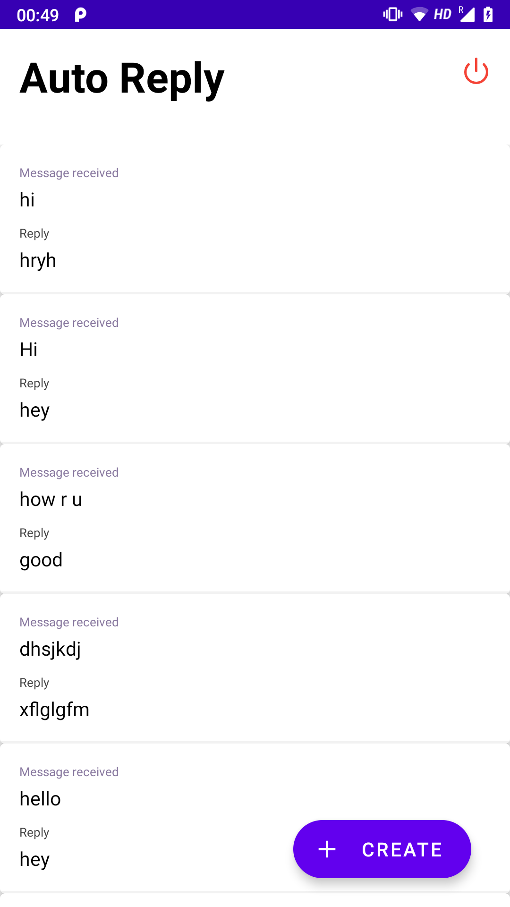

# WhatsApp Bot

Define your expected messages and your reply to that particular message . Your reply to expected is being saved in Realm DB and when some Notification pop-up it'll listen to it and if there's any reply message in the DB it'll reply to that person. Right now I am only targeting WhatsApp but you can change the package name from com.whatsapp to telegram, signal or any other . 

You Can download my App from playStore https://play.google.com/store/apps/details?id=com.autoai.readnotification

UI/UX by my friend and a very great dev @https://github.com/crazyhitty
